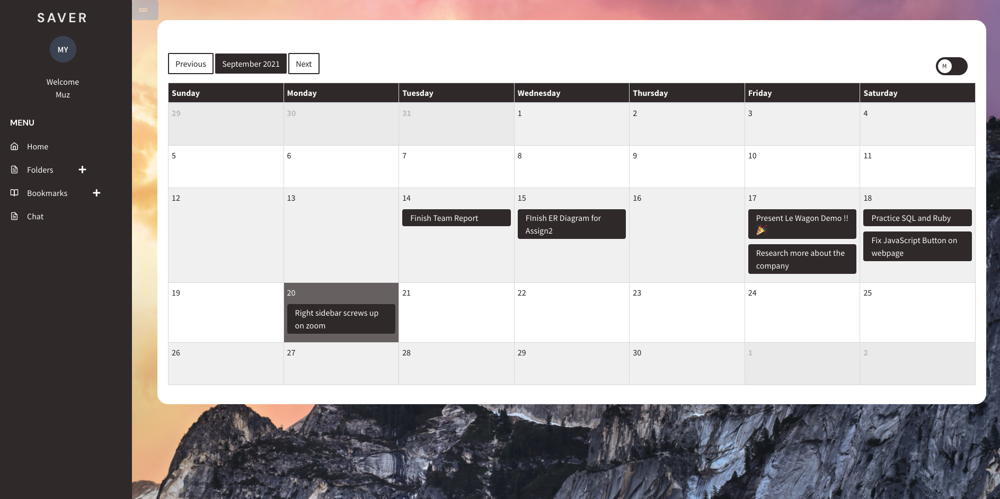
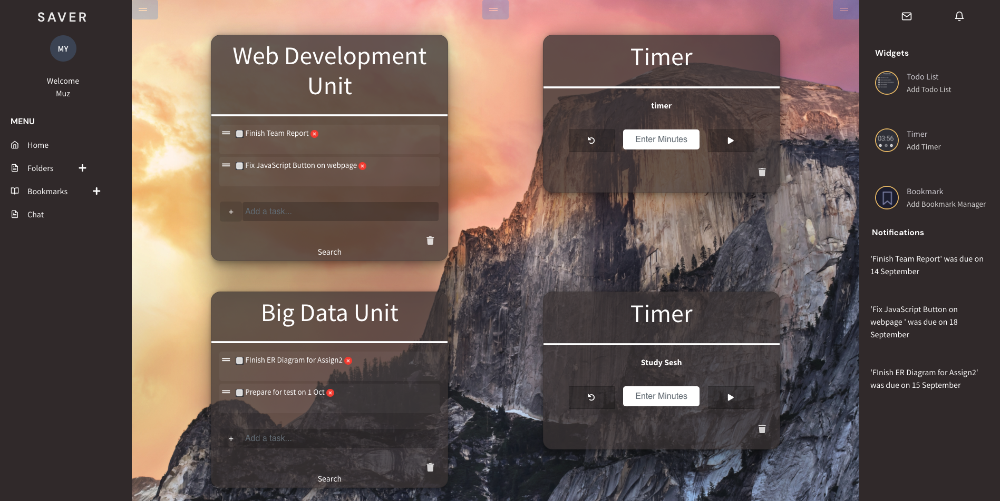

# SAVER

## About

Saver is an all in one productivity tool with draggable widgets and folders for you lifestyle. 

*'All Your Productivity Tools Under One Roof'*


This application was built with
```
Ruby on Rails, Javascript, HTML & CSS.
```

## Live site:

[Monosaver](https://www.monosaver.com/)

## Setup

If you would like to look at the code then clone the GitHub repository and change directory into `saver`:
```
gh repo clone muzyawari/saver
```

You will also need Bundler installed:
```
bundle install
```
This will install the gems needed to run the program correctly.

## Navigating the application

You can create a new account with your email address and a password or alternatively you can log in our admin account with:

`user: demo@saver.com`
`pass: secret`


You will be presented with our calendar on the home page and you will be able to create folders on the left hand side where you will be able to access your widgets. 



Navigate to folders and add widgets including Todo List, Timer and a Bookmark Manager. 



Add in as many bookmarks in your bookmarks manager. 


## Technologies used

- Stimulus JS
- Rest API
- Sortable JS
- Rails Admin
- Simple Calendar Gem
- Redis Cloud
- Postgres DB
- Bootstrap


